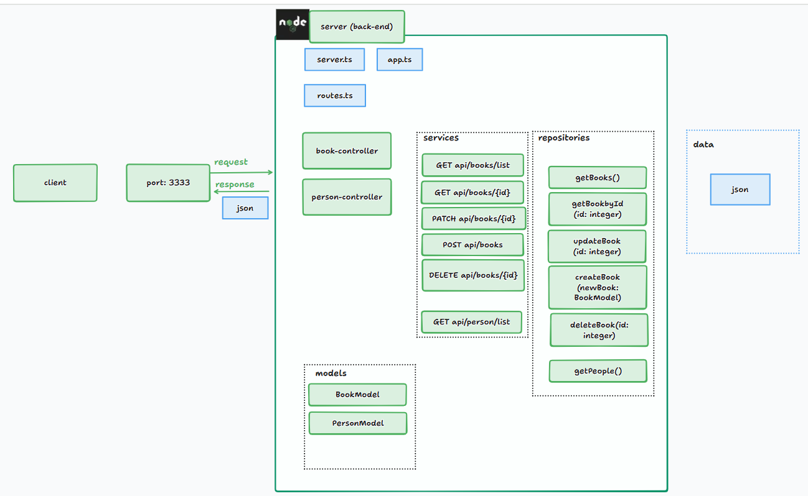
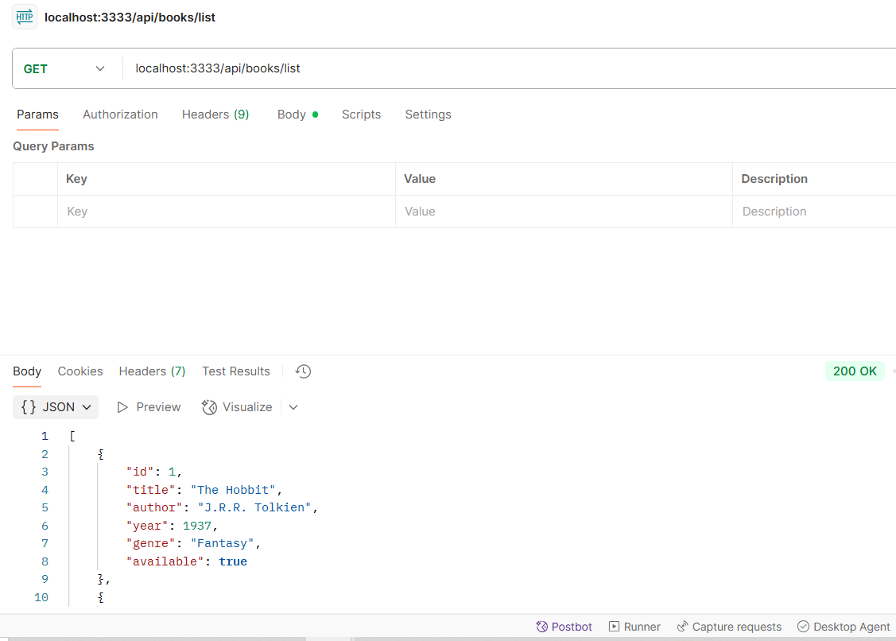

# Simple Book Library API

Esta API tem como tema o gerenciamento de livros em uma biblioteca, e baseia-se no processo de criação realizado no Desafio de Projeto "
Recriando a API da Champions League com Node.js e Express" para o bootcamp da DIO "meutudo - Mobile Developer". 

As funcionalidades são: criação, listagem, atualização e remoção de livros (book), bem como listagem de pessoas (person). A imagem abaixo ilustra a arquitetura que serviu de base para o sistema, e que determina a sua organização. Posteriormente descreve-se as instruções de execução e os endpoints da API.

## Arquitetura que serviu de base



## Como executar

Ter Node.js versão >= v21.1.0 e npm >= 10.4.0 instalados na máquina

Executar o comando ```npm install``` no diretório raiz e ```npm run start:dev``` para executar o sistema. Se tudo ocorrer bem o servidor estará funcionando na porta 3333, e estará atendendo requisições.




## Endpoints

### 1. GET /api/books/list

Descrição: Retorna a lista de todos os livros cadastrados.

Resposta de sucesso (200 - OK): Array de objetos BookModel.

Exemplo de resposta:

```
"body": [
  {
    "id": 1,
    "title": "The Hobbit",
    "author": "J.R.R. Tolkien",
    "year": 1937,
    "genre": "Fantasy",
    "available": true
  },
  ...
]
```

Caso o array esteja vazio, será retornado o código 204 (No Content) e nada será feito.

```
{
    "body": null
}
```


### 2. GET /api/books/:id

Descrição: Retorna um livro específico pelo seu id.

Parâmetro de rota:

id (número) → identificador do livro.

Resposta de sucesso (200 - OK): Objeto BookModel.
```
"body": {
    "id": 1,
    "title": "The Hobbit",
    "author": "J.R.R. Tolkien",
    "year": 1937,
    "genre": "Fantasy",
    "available": true
}
```

Caso não encontre um livro com o id, será retornado o código 204 (No Content) e nada será feito.

```
{
    "body": null
}
```

### 3. POST /api/books

Descrição: Cria um novo livro.

Exemplo de corpo da requisição (JSON):
```
"body": {
    "title": "Percy Jackson: The Lightning Thief",
    "author": "Rick Riordan",
    "year": 2005,
    "genre": "Fantasy",
    "available": true
}
```


Resposta de sucesso (201 - Created): Objeto BookModel com id gerado.

Caso algum campo esteja inválido, será retornado o código 400 (bad request), com a mensagem:

```
{
    "body": "Error creating book"
}
```

### 4. PATCH /api/books/:id

Descrição: Atualiza dados parciais de um livro existente.

Parâmetro de rota:

id (número) → identificador do livro.

Exemplo de corpo da requisição (JSON, parcial):

```
body: {
  "available": false,
  "year": 2012
}
```


Resposta de sucesso (200 - OK): Objeto BookModel atualizado.

Caso não encontre um livro com o id, será retornado o código 400 (Bad request) e nada será feito:


```
{ "body": null }
```

### 5. DELETE /api/books/:id

Descrição: Remove um livro pelo seu id.

Parâmetro de rota:

id (número) → identificador do livro.

Resposta de sucesso (200 - OK):

```
{ "message": "Book deleted successfully" }
```


Caso não encontre um livro com o id, será retornado o código 400 (Bad Request) e nada será feito:

```
{ "body": null }
```

### 6. GET /api/persons/list

Descrição: Retorna a lista de todas as pessoas cadastradas.

Resposta de sucesso (200 - OK): Array de objetos PersonModel.

Exemplo de resposta:

```
"body": [
  {
    "id": 1,
    "name": "Alice Johnson",
    "age": 28,
    "email": "alice.johnson@example.com"
  },
  {
    "id": 2,
    "name": "Bob Smith",
    "age": 35,
    "email": "bob.smith@example.com"
  }
]
```

Caso o array esteja vazio, será retornado o código 204 (No Content) e nada será feito.

```
{
    "body": null
}
```
