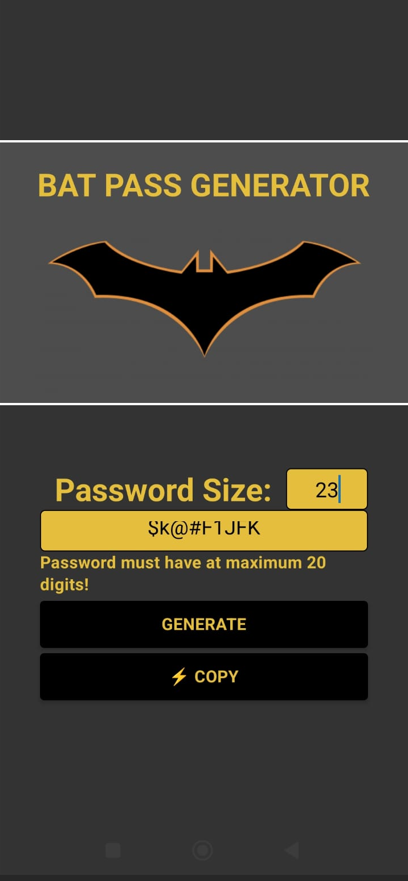

# Bat Pass Generator

Link do repositório original: https://github.com/felipeAguiarCode/react-native-bat-pass-generator.

## Alterações realizadas

1. O componente 'BatButton' não era coeso, pois tinha não só os botões como também a mensagem de texto, logo e chamadas das funções para lidar com geração de senha e cópia de texto. Portanto 'BatButton' foi separado em dois componentes sendo eles: 'BatButton' (recebe como argumento a função atribuida ao botão e o texto que o botão exibe) e 'BatForm' (envolve tudo o que o 'BatButton' tinha, porém essa divisão torna o código melhor organizado);

2. Adição do campo 'Password Size', que permite ao usuário alterar o tamanho da senha gerada. O tamanho da senha pode ser no mínimo 4 digitos e no máximo 20 digitos, do contrário aparecerá uma mensagem de erro;

3. Adição do parâmetro placeholderText ao componente "BatTextInput" para melhor reaproveitamento;

4. O usuário agora pode alterar livremente o campo de texto da senha.

## Como executar

Ter Node.js versão >= v21.1.0 e npm >= 10.4.0 instalados na máquina

Executar os comandos ```npm install``` e ```npm run start``` no diretório raiz. Tendo o Expo GO instalado no celular, escanear o QR Code gerado para visualizar e interagir com a aplicação.

