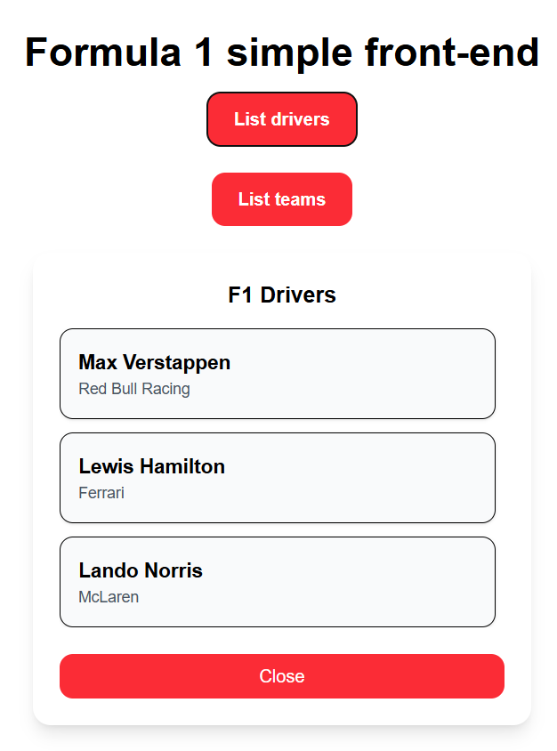

# Minimal API da Fórmula 1 com Node.js e Fastify

Link do repositório original: https://github.com/digitalinnovationone/node-formula-1.

## Alterações realizadas

A API desenvolvida está na pasta back-end. Minha adição consiste em um simples front-end para o qual utilizei Next.js,
com as seguintes características

1. Tem uma única tela 'localhost:3000/', por onde exibe os resultados das chamadas à API em pop-ups;
2. Em /components estão os pop-ups;
3. Em /models estão as definições das interfaces de acordo com as regras de negócio da API;
4. Em /services estão as funções para efetuar as chamadas aos endpoints da API.

## Como executar

Ter Node.js versão >= v21.1.0 e npm >= 10.4.0 instalados na máquina

Executar o comando ```npm install``` no diretório raiz ./ e no ./front-end.
O pacote concurrently é utilizado para executar os dois projetos simultaneamente. Executar  ```npm run start:dev ``` para rodar o projeto.


