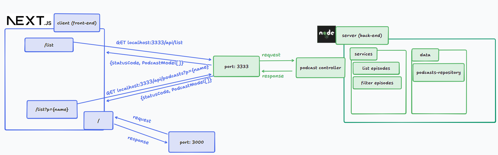
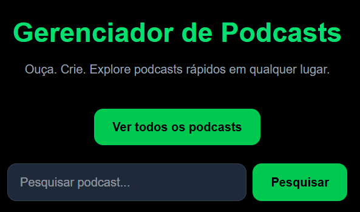
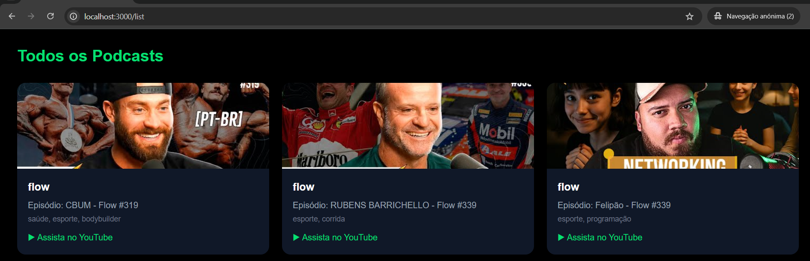

# Podcast Manager

Link do repositório original https://github.com/felipeAguiarCode/node-ts-webapi-without-frameworks-podcast-menager

## Ilustração da arquitetura parcial do sistema



A API desenvolvida pelo Felipão está na pasta back-end. Minha adição consiste em um simples front-end para o qual eu usei o framework Next.js para agilizar a configuração de ambiente e desenvolvimento. As telas disponíveis são:

1. '/' - home, tem os botões para listar os podcasts, podendo filtrar ou não
2. '/list' - listagem de todos os podcasts
3. '/list?p={NOME_DO_PODCAST} - listagem de podcasts filtrando por um nome específico

Além disso, houve a adição de um campo "coverId" no modelo do podcast, para permitir obter a URL da imagem de cada vídeo.

## Como executar

Ter Node.js versão >= v21.1.0 instalado na máquina

Executar o comando ```npm install``` no diretório raiz ./ e no ./front-end.
O pacote concurrently é utilizado para executar os dois projetos simultaneamente. Executar  ```npm run start:dev ``` para rodar o projeto.




