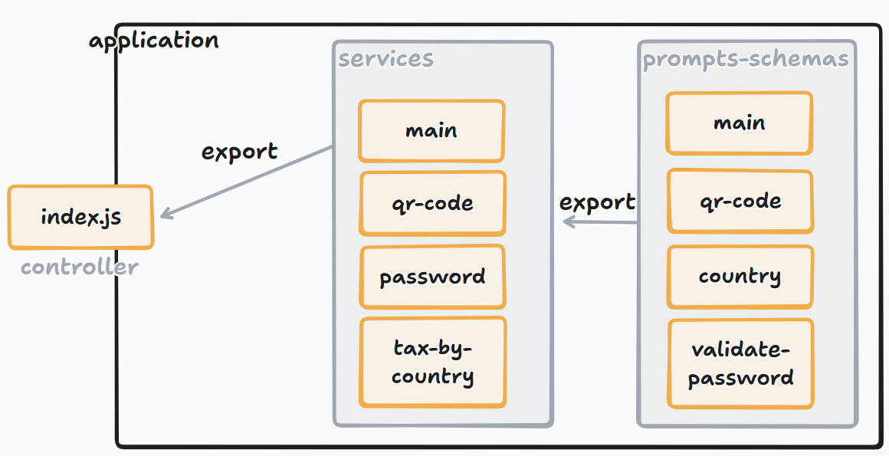

# Gerador de QR Codes para E-commerces com Node.js

Link do repositório original: https://github.com/digitalinnovationone/formacao-nodejs/tree/main/projeto-qrcode

## Alterações realizadas

1. "main" passa a ser um serviço para exibir o menu principal;
2. Os procedimentos antes feitos em index.js estão em services/main;
3. Adição da funcionalidade de determinar a taxa de entrega para cada um de 5 países distintos;
4. Adição da funcionalidade de validar senha;
5. Verificação de URL válida ao gerar QRCode.

## Arquitetura antes das minhas alterações

## Arquitetura após minhas alterações

